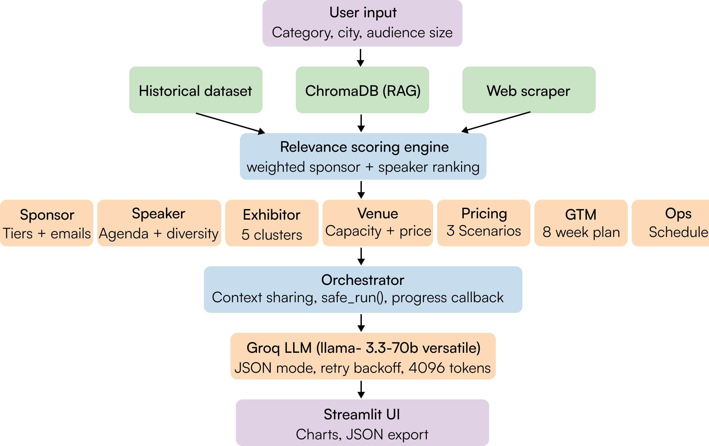

# Event AI Planner  
### Multi-Agent AI System for Event Planning  

## 1. Introduction  

Conferences and large-scale events involve multiple interconnected components such as sponsors, speakers, exhibitors, venues, pricing strategies, and marketing. Traditionally, organizing such events requires manual coordination across fragmented tools, making the process inefficient and difficult to scale.  

This project presents an **AI-powered multi-agent system** that automates end-to-end conference planning using historical data, semantic search (RAG), and intelligent AI agents.

---
## 2. System Overview  


The system follows a **modular multi-agent architecture**, where each agent specializes in one part of the event lifecycle.  

### Key Capabilities  
- Autonomous decision-making using AI agents  
- Context sharing across agents  
- Data-driven recommendations (not generic outputs)  
- End-to-end event planning pipeline  

---
## 3. Architecture Design  

### Multi-Agent Architecture  

| Agent | Function |
|------|--------|
| Sponsor Agent | Recommends and ranks sponsors |
| Speaker Agent | Suggests speakers and agenda |
| Exhibitor Agent | Identifies and clusters exhibitors |
| Venue Agent | Recommends venues |
| Pricing Agent | Predicts pricing and attendance |
| GTM Agent | Builds marketing strategy |
| Event Ops Agent | Generates schedule and detects conflicts |

### Orchestrator 

The **Orchestrator** is the central coordination engine responsible for managing the multi-agent pipeline.

#### Responsibilities:
- Agent execution sequencing  
- Dependency resolution  
- Context sharing  
- Error handling using `_safe_run()`  

#### Context Sharing Examples:
- Speaker count → Pricing  
- Sponsors → GTM  
- Pricing → Event Ops  

---
## 4. Agent Design  

| Agent | Primary Function | Output |
|------|----------------|--------|
| Sponsor Agent | Recommend sponsors | Tiered list + outreach emails |
| Speaker Agent | Suggest speakers & agenda | Lineup + keynote themes |
| Exhibitor Agent | Cluster exhibitors | Categorized list + pricing |
| Venue Agent | Recommend venues | Ranked venues + negotiation tips |
| Pricing Agent | Predict pricing | Revenue + break-even |
| GTM Agent | Marketing strategy | 8-week GTM plan |
| Event Ops Agent | Scheduling | Conflict-free agenda |

---
## 5. Results  

The system generates a **complete conference plan** via a Streamlit dashboard.

| Module        | Output                                          |
|---------------|--------------------------------------------------|
| Sponsors      | Ranked sponsors + outreach emails               |
| Speakers      | Speaker lineup + session types                  |
| Exhibitors    | Clustered exhibitors + pricing                  |
| Venues        | Ranked venues + cost estimates                  |
| Pricing       | Revenue forecasts + break-even analysis         |
| GTM Strategy  | Marketing calendar + outreach templates         |
| Schedule      | Conflict-free agenda                            |

### Live Demo

**Try the app here:**  
🔗 [Event AI Planner](https://event-ai-planner.streamlit.app/)

---
## 6. Project Structure

```
## 🖥️ Project Structure

Event_AI_Planner/
│
├── data/
│   └── events_merged_2025_2026.xlsx     
│
├── agents/
│   ├── orchestrator.py                  
│   ├── sponsor_agent.py                 
│   ├── speaker_agent.py                 
│   ├── exhibitor_agent.py               
│   ├── venue_agent.py                   
│   ├── pricing_agent.py                
│   ├── gtm_agent.py                     
│   └── event_ops_agent.py             
│
├── tools/
│   ├── data_loader.py                   
│   ├── embeddings.py                   
│   ├── llm.py                           
│   ├── ranker.py                        
│   ├── scoring.py                     
│   └── web_scraper.py                   
│
├── ui/
│   └── app.py                          
│
├── requirements.txt                    
├── setup.py                             
├── test_fallbacks.py                   
└── .env.example                        
```


Expected columns:
- Event Name, Year, Category, Geography, City
- Audience Size, Actual Attendance
- Ticket Price Early, Ticket Price Standard, Ticket Price VIP
- Sponsors, Key Speakers, Key Exhibitors
- Website, Data Source


## How Each Agent Works

| Agent | Input | Output | Data Used |
|-------|-------|--------|-----------|
| Sponsor | category, geography, size | Top sponsors + email template | Historical sponsor frequency |
| Speaker | category, geography, size | Speaker list + agenda | Historical speaker frequency |
| Exhibitor | category, geography, budget | Clustered exhibitors + pricing | Historical exhibitor data |
| Venue | city, size, budget | 5 venues with scorecards | City tier + past events |
| Pricing | category, geography, size | 3 pricing tiers + revenue model | Historical price statistics |
| GTM | category, geography, date | Communities + 8-week plan |  |
| Event Ops | speakers from above | Full schedule + risk register | Dataset |

## Tech Stack

- **AI**: Groq (LLaMA models for all agent reasoning)
- **Vector DB**: ChromaDB + sentence-transformers (RAG)
- **Data**: Pandas + OpenPyXL (Excel processing)
- **ML**: NumPy + Scikit-learn (pricing regression)
- **UI**: Streamlit + Plotly (frontend)

## Data Sources

The dataset covers 120+ unique events (2025–2026) across:
- **Geographies**: USA, Europe, India, Singapore
- **Categories**: AI, Web3, ClimateTech, SaaS, Music Festivals, Sports, Startup/Tech
- **Extraction method**: Manual curation from event websites, Eventbrite, LinkedIn Events, and Luma
- **Deduplication**: Matched on normalized Event Name + Year; XLSX version kept when conflicts existed
